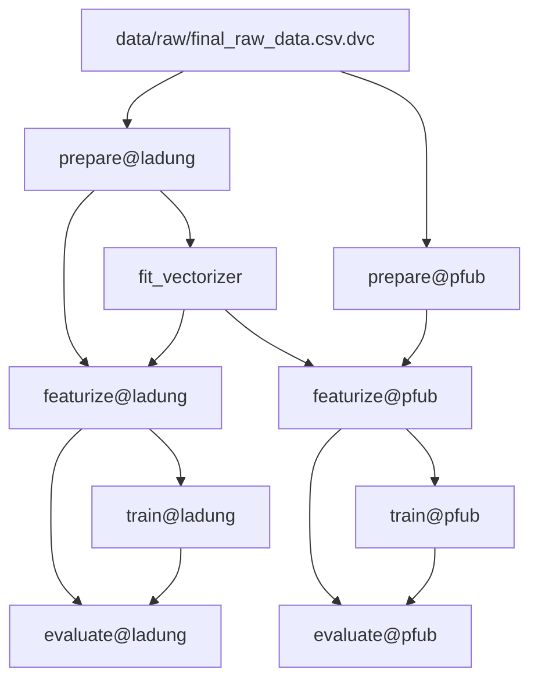

# aftercourt_automation
A repository to track works for Aftercourt Automation

## DVC Pipeline

The ML pipeline is defined in `dvc.yaml` and uses DVC's `foreach` construct to run
the same stages for multiple document-type targets (e.g. **ladung**, **pfub**).
Each target gets its own independent chain of stages with isolated caching.

### Pipeline DAG



### Pipeline stages

```
raw CSV ──► prepare@{target} ──► fit_vectorizer (shared) ──► featurize@{target} ──► train@{target} ──► evaluate@{target}
```

| Stage | Description |
|---|---|
| **prepare@{target}** | Preprocesses raw text and splits into train/test sets (stratified) |
| **fit_vectorizer** | Fits a shared TF-IDF vectorizer on ladung training data (runs once, not per-target) |
| **featurize@{target}** | Transforms text into sparse TF-IDF feature matrices + label arrays |
| **train@{target}** | Trains a Random Forest classifier on featurized data |
| **evaluate@{target}** | Evaluates on test set — outputs metrics, predictions, and plots |

### Running the pipeline

```bash
# Run everything for ALL targets (ladung + pfub)
dvc repro

# Run only the ladung pipeline (end-to-end)
dvc repro evaluate@ladung

# Run only the pfub pipeline
dvc repro evaluate@pfub

# Re-run a single stage (+ its upstream deps if changed)
dvc repro train@ladung
```

### Adding a new target

1. Add the target config in `params.yaml` under `prepare`, `train`, and `evaluate`:
   ```yaml
   prepare:
     new_target:
       aftercourt_preprocessing:
         normalize_whitespace: true
         # ...
       target_col: is_new_target

   train:
     new_target:
       classifier:
         n_estimators: 100
         random_state: 42

   evaluate:
     new_target:
       threshold: 0.5
   ```
2. Add `- new_target` to each `foreach` list in `dvc.yaml`
3. Run `dvc repro evaluate@new_target`

### Configuration

All pipeline parameters live in `params.yaml`. Each target has its own independent
hyperparameters so changing one target does not invalidate another's DVC cache:

| Section | Controls |
|---|---|
| `prepare.{target}` | Preprocessing options and target column per document type |
| `prepare.seed / split` | Train/test split ratio and random seed (shared) |
| `fit_vectorizer` | TF-IDF vectorizer hyperparameters (shared across targets) |
| `train.{target}.classifier` | Random Forest hyperparameters per target (n_estimators, random_state) |
| `evaluate.{target}.threshold` | Probability threshold per target |

## Experiment Tracking with MLflow

The DVC pipeline stages (`train` and `evaluate`) automatically log parameters,
metrics, artifacts, and plots to **MLflow**.

Each target gets its **own MLflow experiment** (e.g. `experiment_name/ladung`,
`experiment_name/pfub`) and its own MLflow run per `dvc repro`, so targets never
interfere with each other.

### Quick start

```bash
# 1. Install MLflow (already in environment.yaml)
pip install "mlflow>=2.12.0"

# 2. Run the full pipeline – MLflow logging happens automatically
dvc repro

# 3. Launch the MLflow UI to browse experiments
mlflow ui --backend-store-uri mlruns
# Then open http://127.0.0.1:5000 in your browser
```

### MLflow configuration

MLflow settings live in `params.yaml` under the `mlflow` key:

```yaml
mlflow:
  tracking_uri: mlruns     # local directory (default)
  experiment_name: aftercourt_automation
```

The experiment name is automatically suffixed with the target name, producing
experiments like `aftercourt_automation/ladung` and `aftercourt_automation/pfub`.

To switch to a **remote tracking server**, change `tracking_uri`:

```yaml
mlflow:
  tracking_uri: http://mlflow-server:5000
  experiment_name: aftercourt_automation
```

### What gets logged

| Stage      | Logged to MLflow                                                           |
|------------|---------------------------------------------------------------------------|
| **train**  | All pipeline params, training set stats, sklearn model (model registry)   |
| **evaluate** | Accuracy, precision, recall, F1, ROC-AUC, confusion matrix, threshold, ROC/PR/CM plots |

Within each target, `train` and `evaluate` share a **single MLflow run**, so all
information for one target is visible in one place.

### Directory layout

- `mlruns/` – local MLflow tracking store (git-ignored)
- `src/mlflow_utils.py` – shared helpers (`init_mlflow`, `get_or_create_run`, …)
